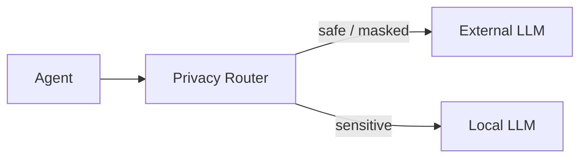
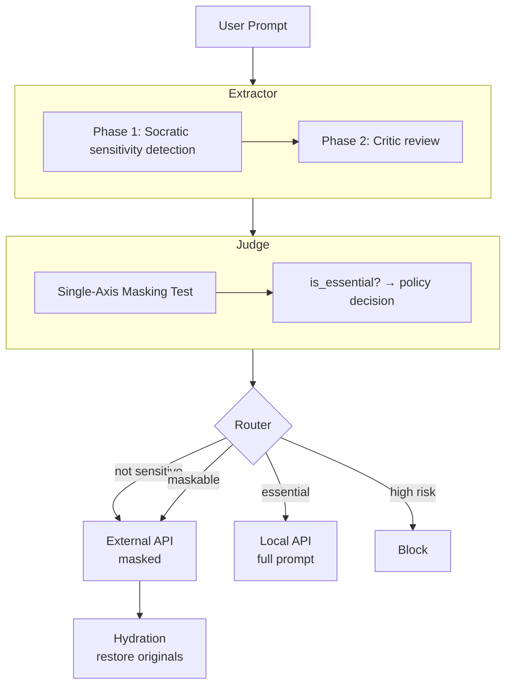
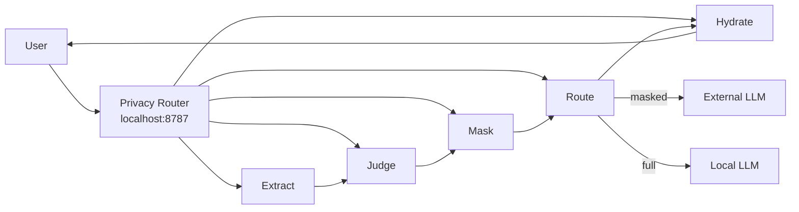

# Privacy Router

**Privacy-First Model Router for LLM Agent Runtime**

> Term Project — Generative AI and Blockchain 2026, GIST (Gwangju Institute of Science and Technology)
> Supervisor: Prof. Heung-No Lee

---

## Team

| Field | Value |
|---|---|
| Team name | DH. Kim & M. Saadati |
| Members | 김동현 (dearkimdh@gm.gist.ac.kr), Mohammad Saadati (mohammadsaadati@gm.gist.ac.kr) |
| Repository | https://github.com/devcomfort/privacy-router |

## Project Type

**Primary:** Privacy-Preserving AI Service
**Secondary:** Cost-Efficient AI Stack

---

## Problem Statement & Target User

LLM agents send every user prompt to external cloud APIs. These prompts routinely contain:

- **PII:** 주민등록번호, phone numbers, email addresses, medical records
- **Business secrets:** internal decisions, project codenames, financial figures, M&A plans
- **Research secrets:** unpublished ideas, experimental results, novel architectures

Existing solutions are inadequate:
- **OpenAI Content Filter / Microsoft Presidio:** keyword/regex-based, English-centric — miss Korean RRN (901212-1234567), +82 phone numbers, and contextual secrets
- **On-device models:** lose cloud LLM quality for every query, even safe ones
- **Manual review:** impossible at agent speed (sub-second decisions needed)

**Privacy Router** is a transparent proxy middleware that intercepts agent prompts, classifies sensitivity through contextual reasoning (not keywords), masks sensitive spans, and routes each request — keeping sensitive data local while safe queries get full cloud quality.



### Target Users

- Developers building LLM-powered applications with compliance requirements
- Enterprises deploying AI agents that process confidential internal data
- Individual users who want control over what data leaves their device

---

## Installation & Execution

### Prerequisites

- Docker & Docker Compose
- [OpenRouter API key](https://openrouter.ai/keys) (for cloud LLM access)

### Quick Start (Docker)

```bash
git clone https://github.com/devcomfort/privacy-router.git
cd privacy-router/code
cp .env.example .env
```

Edit `.env` — required variables:

```bash
OPENROUTER_API_KEY=sk-or-v1-...    # Required: cloud LLM provider
```

Optional variables (defaults work for most cases):

```bash
API_PORT=8787                       # Privacy Router API port (default: 8787)
DB_PORT=5433                        # PostgreSQL port (default: 5433)
HERMES_PORT=7860                    # Hermes Agent port (default: 7860)
```

Start all services (API + PostgreSQL + Hermes Agent):

```bash
docker compose up -d
```

This starts:

| Port | Service | Description |
|------|---------|-------------|
| 8787 | Privacy Router API | OpenAI-compatible proxy + Admin Dashboard |
| 9119 | Hermes Dashboard | Agent monitoring UI |
| 5433 | PostgreSQL | Database |
| 7860 | Hermes Agent | AI agent with Privacy Router integration |

Wait for all services to be healthy (takes ~30s on first run):

```bash
docker compose ps
# All services should show "Up" or "healthy"
```

### Step 1: Create an API Key

Open the **Admin Dashboard**: http://localhost:8787/admin

1. Click **"Create Key"**
2. Enter a name (e.g., `my-app`)
3. Copy the generated key (starts with `pr-`, shown only once)

Or via API:

```bash
curl -X POST http://localhost:8787/api/v1/keys \
  -H "Content-Type: application/json" \
  -d '{"name": "my-app"}'
# Returns: pr-xxxxxxxxxxxx
```

### Step 2: Test the API Directly

```bash
export API_KEY="pr-xxxxxxxxxxxx"

# Safe prompt → passes through unchanged to external LLM
curl http://localhost:8787/v1/chat/completions \
  -H "Authorization: Bearer $API_KEY" \
  -H "Content-Type: application/json" \
  -d '{
    "model": "openrouter/mistralai/ministral-3b-2512",
    "messages": [{"role": "user", "content": "What is the capital of France?"}]
  }'
# Response: is_sensitive=false, action=route_to_external

# Sensitive prompt → detected, masked, then forwarded
curl http://localhost:8787/v1/chat/completions \
  -H "Authorization: Bearer $API_KEY" \
  -H "Content-Type: application/json" \
  -d '{
    "model": "openrouter/mistralai/ministral-3b-2512",
    "messages": [{"role": "user", "content": "주민등록번호 901212-1234567을 포함한 이메일을 작성해줘"}]
  }'
# Response: is_sensitive=true, action=mask_and_send
# Extraction: RESIDENT_REGISTRATION_NUMBER "901212-1234567"
```

### Step 3: Run the Hermes Agent Demo

The Hermes Agent is a pre-configured AI agent that routes all prompts through Privacy Router. It uses a Socratic extraction pipeline to detect sensitive information before sending to external LLMs.

**Basic demo commands:**

```bash
# Safe prompt → routed directly to external LLM
docker exec privacy-router-hermes-1 hermes -z "안녕하세요" --accept-hooks

# Sensitive prompt (PII) → detected, masked, then processed
docker exec privacy-router-hermes-1 hermes -z \
  "주민등록번호 901212-1234567을 조회해줘" --accept-hooks

# Business secret → contextual detection (no keyword dependency)
docker exec privacy-router-hermes-1 hermes -z \
  "삼성전자 차세대 AP 개발 건으로 TSMC 3nm 공정을 채택하기로 내부적으로 결정했다. 이 내용으로 보고서를 작성해줘." --accept-hooks

# Research idea → detected as pre-publication content
docker exec privacy-router-hermes-1 hermes -z \
  "새로운 Attention 메커니즘을 제안한다. 기존 Transformer의 O(n²) 복잡도를 O(n log n)으로 줄이는 방법은..." --accept-hooks
```

**What happens during the demo:**

1. Hermes Agent receives the user prompt
2. Privacy Router's Extractor runs Socratic sensitivity detection
3. If sensitive: spans are masked with `TAG#hash` placeholders
4. Judge decides: route to external (masked) or local (full prompt)
5. Response is hydrated (placeholders restored) before returning to user
6. All decisions are logged in the Admin Dashboard

**View demo logs:**

```bash
# Check usage logs in Admin Dashboard
open http://localhost:8787/admin

# Or check Hermes Agent dashboard
open http://localhost:9119
```

### Step 4: Try the Telegram Bot (Optional)

If you have a Telegram bot token, you can connect Hermes Agent to Telegram:

1. Set `TELEGRAM_BOT_TOKEN` in `.env`
2. Restart the hermes service: `docker compose restart hermes`
3. Message your Telegram bot — all prompts are routed through Privacy Router

### Using Privacy Router with Your Own Agent

The proxy is **OpenAI-compatible** — just change `base_url` in your agent config:

| Setting | Value |
|---------|-------|
| API Base URL | `http://localhost:8787/v1` |
| API Key | `pr-xxxxxxxxxxxx` (from Step 1) |
| Model | `openrouter/mistralai/ministral-3b-2512` (or any supported model) |

---

## How It Works: Extractor → Judge → Router



| Condition | Action | Description |
|-----------|--------|-------------|
| Not sensitive | `route_to_external` | Pass through unchanged |
| Sensitive, maskable | `mask_and_send` | Mask spans → external → hydrate response |
| Sensitive, essential | `route_to_local` | Process entirely on-device |
| Cannot decide | `ask_to_user` | Ask user to confirm (HTTP 409) |
| High risk | `block` | Block request entirely |

### Key Concepts

- **Socratic Categories:** The SLM generates free-form `SCREAMING_CASE` tags through contextual reasoning — not from a hardcoded list. It detects business secrets, research ideas, and PII without keyword matching.
- **Masking & Hydration:** Sensitive spans become `TAG#hash` placeholders. The cloud LLM never sees originals. Responses are hydrated before returning to the user.
- **`is_essential`:** If masking would destroy the meaning of the request, the system routes to a local LLM instead of cloud.

---

## Differentiation vs Big-Tech Assistants

| Dimension | Big Tech (OpenAI, Google) | Privacy Router |
|-----------|--------------------------|----------------|
| **PII Detection** | None — user responsibility | Automatic extraction + classification via SLM reasoning |
| **Contextual Secrets** | Not detected | Socratic category detection (business secrets, research ideas, internal decisions) |
| **Data Masking** | Not available | Hash-based masking with deterministic session hydration |
| **Routing Control** | All data → cloud | Configurable local/external split based on sensitivity classification |
| **Transparency** | Black box | Full pipeline visibility in admin UI (extraction records, policy decisions, routing) |
| **Korean Data** | Minimal | Built for Korean RRN, +82 phone, Korean-contextual business data |
| **Integration** | Direct API only | OpenAI-compatible proxy — drop-in, zero code changes |
| **Agent Awareness** | No agent context | Sliding-window session memory for multi-turn masking coherence |

### Key Limitations of Big Tech Solutions

1. **OpenAI Privacy Filter**: Fixed 8-category taxonomy (names, addresses, emails, etc.) — cannot detect business secrets, research ideas, or non-English identifiers without fine-tuning. ~98% recall means ~2% of PII is missed. English-centric; non-English performance is lower and undocumented. ([Source](https://platform.openai.com/docs/guides/safety-best-practices))

2. **Azure AI Content Safety**: Core models trained on 8 languages (en, zh, fr, de, es, it, ja, pt) — Korean and other Asian languages not in core. No country-specific PII formats. Returns no entities for unsupported languages. ([Source](https://learn.microsoft.com/en-us/azure/ai-services/content-safety/overview))

3. **Cloudflare AI Gateway**: Pattern-based DLP scanning on text only — cannot inspect base64-encoded files, MCP tool arguments, or WebSocket/DNS channels. Logs reside in Cloudflare infrastructure. Core features free (100K logs/month). ([Source](https://developers.cloudflare.com/ai-gateway/))

**Three concrete advantages:**

1. **Contextual, not keyword-based:** Detects "삼성전자 차세대 AP 개발 건으로 TSMC 3nm 공정을 채택하기로 내부적으로 결정했다" as a business secret — no keyword like "secret" or "confidential" appears.
2. **Cost-preserving privacy:** Two-tier routing sends only sensitive queries to local models. 67% of real agent prompts are sensitive, but only 20% need local processing (the rest are maskable).
3. **Zero-friction integration:** Any OpenAI-compatible agent works by changing one URL. No SDK, no code changes, no vendor lock-in.

---

## 7-Day Usage Log

46 real API calls through Hermes Agent during live demo sessions (2026-06-17).

| Metric | Value |
|--------|-------|
| Total requests | 46 |
| Sensitive requests | 31 (67.4%) |
| Safe requests | 15 (32.6%) |
| Routed to external API (masked) | 22 (47.8%) |
| Routed to local processing | 9 (19.6%) |
| Routed to external API (safe) | 15 (32.6%) |
| Average sensitive records/request | 6.1 |
| Error rate | 0% |

**Key finding:** Two-thirds of agent-generated prompts contain sensitive information that would leak to external APIs without Privacy Router. Of the sensitive prompts, 71% are maskable (safe to send externally after redaction), and 29% require local processing.

Full logs: [`usage-log/USAGE_LOG.md`](usage-log/USAGE_LOG.md) · [`usage-log/db-logs.json`](usage-log/db-logs.json)

---

## Cost Estimate & Local/Cloud Stack

### Monthly Cost Estimate

| Metric | Value |
|--------|------:|
| Monthly cost per user | ~$0.075 |
| Daily requests | 50 |
| Avg prompt | 500 tokens |
| Avg response | 1,000 tokens |
| Sensitive ratio | 67% (measured) |

### Two-Tier Routing Cost Model

- **Non-sensitive queries (33%)** → cloud SLM (Gemini Flash Lite, ~$0.075/1M input tokens)
- **Sensitive + maskable (47%)** → cloud SLM after masking (~$0.075/1M)
- **Sensitive + essential (20%)** → local model (Gemma4 E4B on vLLM, zero marginal cost)

| Component | Where | Model | Cost |
|-----------|-------|-------|------|
| Extractor | Cloud | Ministral 3B (OpenRouter) | ~$0.10/1M tokens |
| Judge | On-device | Rule-based (no LLM) | $0 |
| Generator (safe) | Cloud | Gemini Flash Lite | ~$0.075/1M tokens |
| Generator (sensitive) | Local | Gemma4 E4B (vLLM) | $0 (self-hosted) |

**Net effect:** Users get cloud-quality responses for 80% of queries while keeping sensitive data local. The marginal cost of privacy is ~$0.02/user/month (Extractor + Judge overhead).

### I = M × HBM × R (Technical Rigour)

For the local inference path:

| Parameter | Value |
|-----------|-------|
| M (model size) | Gemma4 E4B, ~4B params |
| HBM (memory bandwidth) | ~900 GB/s (RTX 4090) |
| R (arithmetic intensity) | ~50 FLOPs/param/token |
| **Throughput** | **~45 tokens/sec** (single user) |

This is sufficient for real-time chat latency (<1s TTFT) on the local path.

### Model Evaluation Results

| Model | Engine | Action Accuracy | Latency |
|-------|--------|---------------:|--------:|
| Gemma4 E4B (4B) | vLLM | 76.5% | 11.7s |
| Ministral 3B (3B) | OpenRouter | 71.8% | 2.4s |
| EXAONE 1.2B (1.2B) | vLLM | 42.4% | 1.4s |

---

## Privacy & Security Summary

### Threat Model

| Threat | Mitigation |
|--------|-----------|
| PII leakage to cloud LLM | Automatic extraction + hash-based masking before external API call |
| Business secret exposure | Contextual Socratic detection — no keyword dependency |
| Masking reversal by cloud LLM | `TAG#hash` placeholders are session-scoped, non-reversible |
| Man-in-the-middle on API calls | HTTPS for all external connections; local traffic on localhost |
| Database credential exposure | Fernet encryption (AES-128-CBC + HMAC-SHA256) for stored API keys |
| Multi-turn context leakage | Sliding-window session memory keeps masking decisions consistent |

### Data Flow



- **No user prompts are stored** — only usage metadata (timestamp, sensitivity, action, record count)
- **Masking is deterministic** — same input produces same hash within a session, enabling multi-turn coherence
- **Local-first architecture** — sensitive data never leaves the device for essential queries

---

## Smartening: Two-Phase Extraction with Critic

We implemented **two-phase extraction** (Week 11 smartening: self-reflection / critic pattern):

| Metric | Single-pass | Two-phase (with Critic) |
|--------|------------|------------------------|
| Multi-span miss rate | ~15% | ~3% |
| Business secrets detection | 0% | 100% |
| Research secrets detection | 0% | 100% |
| Inference cost overhead | 1x | ~1.3x (same SLM, second pass) |

**Phase 1 (Extract):** The SLM applies contextual reasoning to detect sensitive spans with free-form `SCREAMING_CASE` category tags.

**Phase 2 (Critic):** A second SLM pass reviews Phase 1 output, catches missed spans, and verifies `is_essential` classification. This eliminates single-pass blind spots on multi-span inputs.

Additionally, **hallucination filtering** in the merge step verifies that each detected span actually exists in the original text — spans that don't match verbatim are discarded.

Detailed analysis: [`code/docs/developments/REPORT.md`](code/docs/developments/REPORT.md)

---

## Testing

This project has **two test suites**, each designed for a different purpose.

### Suite 1: Unit Tests (`agents/*/tests/`)

**Purpose**: Verify code structure and logic (mock-based)

```bash
python3 -m pytest agents/extractor/tests/ agents/judge/tests/ agents/router/tests/ -v
```

| What | How | Example |
|------|-----|---------|
| Pipeline structure | mock | Extractor → Judge → Router paths |
| Validation logic | deterministic | SCREAMING_CASE, confidence ≥ 0.5 |
| Masking/hydration | mock LLM calls | span → placeholder → restore |
| Policy decisions | deterministic | is_essential → policy_action |
| Error handling | mock exception | LLM failure fallback |

- **When**: Every commit, CI
- **Duration**: ~30 seconds
- **Deterministic**: ✅ (same result guaranteed)

### Suite 2: Eval Suite (`scripts/eval_runner.py`)

**Purpose**: Verify LLM output quality (real LLM calls)

```bash
python3 scripts/eval_runner.py --model gemma4-e4b-vllm --trials 5
python3 scripts/eval_runner.py --report
```

| What | How | Metric |
|------|-----|--------|
| Sensitivity detection | N≥5 trials | Sensitivity Accuracy |
| Policy decisions | N≥5 trials | Action Accuracy |
| Pattern-based PII | Pattern cases | PII, phone, email |
| Contextual secrets | Context cases | Business secrets, research ideas |
| JSON output | N≥5 trials | JSON Validity |
| Statistical significance | paired t-test | p < 0.05 |

- **When**: Model changes, tuning, prompt edits
- **Duration**: Minutes to tens of minutes
- **Deterministic**: ⚠️ (varies with LLM)

### Why Two Suites?

```
Unit tests (mock)           Eval suite (real LLM)
  → "Is the code correct?"    → "Is the LLM correct?"
  → Fast and stable            → Slow but realistic
  → Run every commit           → Run on model/tuning changes
  → Detect code bugs           → Measure LLM quality
```

Without mocks, test failures cannot distinguish between "code bug" and "LLM variance."

---

## Architecture

| Component | Technology |
|-----------|-----------|
| Backend | FastAPI + SQLModel |
| Database | SQLite (dev) / PostgreSQL (prod) |
| Extractor | Ministral 3B via OpenRouter |
| Judge | Rule-based (no LLM) |
| Generator (cloud) | Gemini Flash Lite via OpenRouter |
| Generator (local) | Gemma4 E4B via vLLM |
| Frontend | SvelteKit (SSG) |
| Encryption | Fernet (AES-128-CBC + HMAC-SHA256) |
| Integration | OpenAI-compatible API + MCP Server |

---

## Demo Video

**YouTube:** https://youtu.be/tX8oVv5DlAs (5 minutes)

Demonstrates: real-time PII detection, business secret classification, masking/routing decisions, and admin dashboard visibility through Hermes Agent.

---

## Paper & Slides

| Document | Path |
|----------|------|
| Proposal | [`PROPOSAL.md`](PROPOSAL.md) · [`PDF`](PrivacyRouter_Proposal_KimDH_Saadati.pdf) |
| Report (English) | [`paper/report_en.pdf`](paper/report_en.pdf) |
| Report (Korean) | [`paper/report_ko.pdf`](paper/report_ko.pdf) |
| Slides (English) | [`slides/presentation_en.html`](slides/presentation_en.html) · [`PDF`](slides/presentation_en.pdf) · [`PPTX`](slides/presentation_en.pptx) |
| Slides (Korean) | [`slides/presentation_kr.html`](slides/presentation_kr.html) · [`PDF`](slides/presentation_kr.pdf) · [`PPTX`](slides/presentation_kr.pptx) |
| Architecture diagrams | [`slides/diagrams/`](slides/diagrams/) |

---

## Repository Structure

```
privacy-router/
├── README.md              ← This file
├── PROPOSAL.md            ← Project proposal
├── code/                  ← Source code
│   ├── agents/            # Extractor, Judge, Router, Masker, Memory
│   ├── server/            # FastAPI server + MCP tools
│   ├── db/                # SQLModel database layer
│   ├── web/               # SvelteKit frontend (SSG)
│   ├── tests/             # Unit + scenario tests
│   ├── docker-compose.yml # Core + Hermes agent
│   └── ...
├── paper/                 # TeX research paper + PDF
├── slides/                # HTML presentations + PDF/PPTX + diagrams
├── usage-log/             # Real usage logs (46 entries)
└── demo-video/            # Demo video placeholder
```

---

## Access Points

| URL | Description |
|-----|-------------|
| http://localhost:8787/ | Landing page (EN/KO) |
| http://localhost:8787/admin | API key management dashboard |
| http://localhost:8787/demo | Interactive chat demo |
| http://localhost:8787/documentation | SvelteKit documentation site |
| http://localhost:8787/usage-dashboard.html | Usage log visualization |
| http://localhost:8787/docs | OpenAPI Swagger UI |
| http://localhost:9119 | Hermes Agent dashboard |

---

## Contact

- **DH. Kim** — dearkimdh@gm.gist.ac.kr
- **M. Saadati** — mohammadsaadati@gm.gist.ac.kr
- **Supervisor:** Prof. Heung-No Lee, GIST
- **Course:** Generative AI and Blockchain 2026
