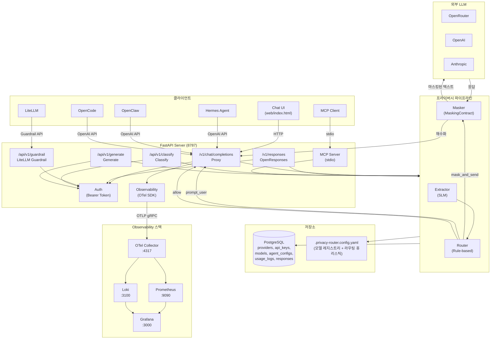
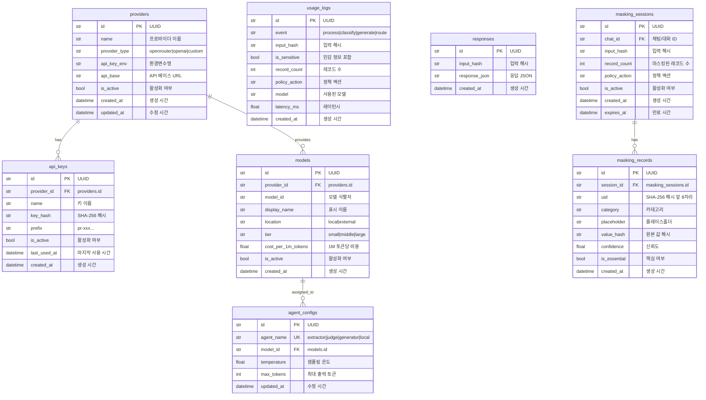
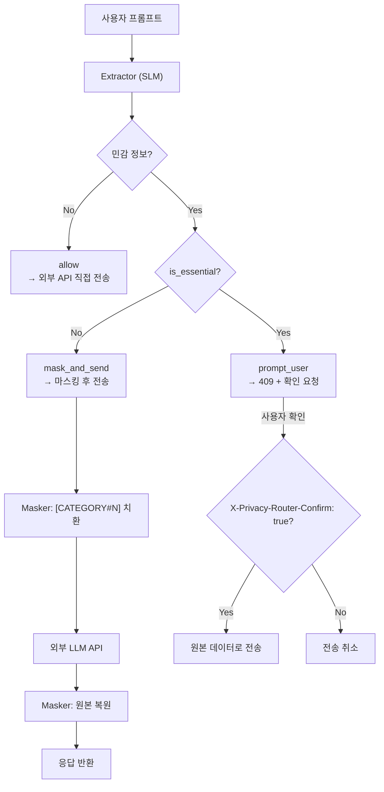
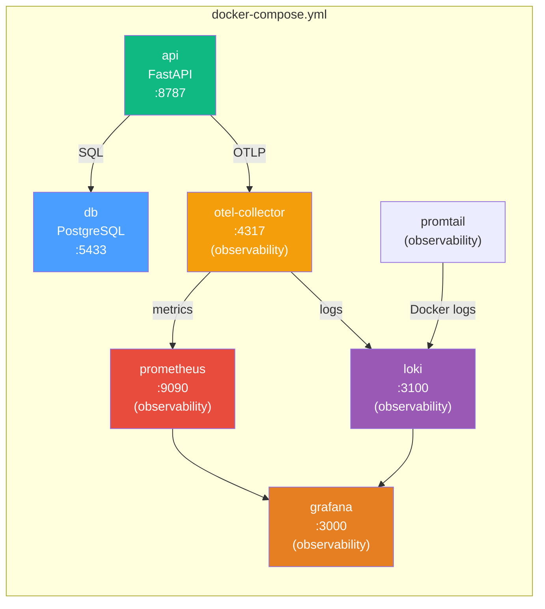
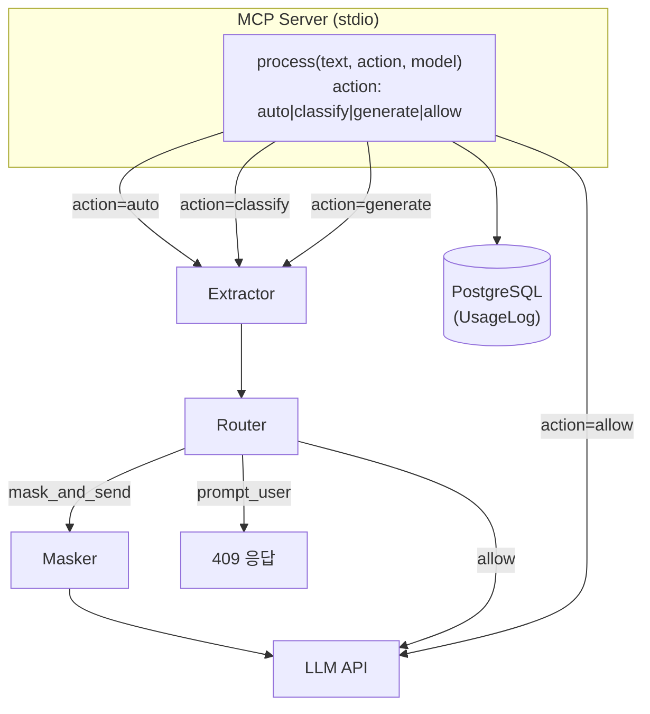

# Privacy Router — Architecture Diagrams

## 시스템 아키텍처

```mermaid
graph TB
    subgraph Client["클라이언트"]
        ChatUI["Chat UI<br/>(web/index.html)"]
        HermesAgent["Hermes Agent"]
        OpenClaw["OpenClaw"]
        OpenCode["OpenCode"]
        LiteLLM["LiteLLM"]
        MCPClient["MCP Client"]
    end

    subgraph Server["FastAPI Server (8787)"]
        Proxy["/v1/chat/completions<br/>Proxy"]
        Responses["/v1/responses<br/>OpenResponses"]
        Guardrail["/api/v1/guardrail<br/>LiteLLM Guardrail"]
        Classify["/api/v1/classify<br/>Classify"]
        Generate["/api/v1/generate<br/>Generate"]
        MCPServer["MCP Server<br/>(stdio)"]
        Auth["Auth<br/>(Bearer Token)"]
        Obs["Observability<br/>(OTel SDK)"]
    end

    subgraph Pipeline["프라이버시 파이프라인"]
        Extractor["Extractor<br/>(SLM)"]
        Router["Router<br/>(Rule-based)"]
        Masker["Masker<br/>(MaskingContract)"]
    end

    subgraph Storage["저장소"]
        PostgreSQL[("PostgreSQL<br/>providers, api_keys,<br/>models, agent_configs,<br/>usage_logs, responses")]
        ConfigYAML[".privacy-router.config.yaml<br/>(모델 레지스트리 + 라우팅 휴리스틱)"]
    end

    subgraph Observability["Observability 스택"]
        OTelCollector["OTel Collector<br/>:4317"]
        Prometheus["Prometheus<br/>:9090"]
        Loki["Loki<br/>:3100"]
        Grafana["Grafana<br/>:3000"]
    end

    subgraph External["외부 LLM"]
        OpenRouter["OpenRouter"]
        OpenAI["OpenAI"]
        Anthropic["Anthropic"]
    end

    ChatUI -->|HTTP| Proxy
    HermesAgent -->|OpenAI API| Proxy
    OpenClaw -->|OpenAI API| Proxy
    OpenCode -->|OpenAI API| Proxy
    LiteLLM -->|Guardrail API| Guardrail
    MCPClient -->|stdio| MCPServer

    Proxy --> Auth
    Proxy --> Pipeline
    Proxy --> Obs
    Responses --> Auth
    Responses --> Pipeline
    Guardrail --> Auth
    Classify --> Auth
    Classify --> Pipeline
    Generate --> Auth
    Generate --> Pipeline
    MCPServer --> Pipeline

    Extractor --> Router
    Router -->|mask_and_send| Masker
    Router -->|prompt_user| Proxy
    Router -->|allow| Proxy

    Pipeline --> PostgreSQL
    Pipeline --> ConfigYAML

    Obs -->|OTLP gRPC| OTelCollector
    OTelCollector --> Prometheus
    OTelCollector --> Loki
    Prometheus --> Grafana
    Loki --> Grafana

    Masker -->|마스킹된 텍스트| External
    External -->|응답| Masker
    Masker -->|재수화| Proxy
```

## 데이터베이스 스키마

```mermaid
erDiagram
    providers {
        str id PK "UUID"
        str name "프로바이더 이름"
        str provider_type "openrouter|openai|custom"
        str api_key_env "환경변수명"
        str api_base "API 베이스 URL"
        bool is_active "활성화 여부"
        datetime created_at "생성 시간"
        datetime updated_at "수정 시간"
    }

    api_keys {
        str id PK "UUID"
        str provider_id FK "providers.id"
        str name "키 이름"
        str key_hash "SHA-256 해시"
        str prefix "pr-xxx..."
        bool is_active "활성화 여부"
        datetime last_used_at "마지막 사용 시간"
        datetime created_at "생성 시간"
    }

    models {
        str id PK "UUID"
        str provider_id FK "providers.id"
        str model_id "모델 식별자"
        str display_name "표시 이름"
        str location "local|external"
        str tier "small|middle|large"
        float cost_per_1m_tokens "1M 토큰당 비용"
        bool is_active "활성화 여부"
        datetime created_at "생성 시간"
    }

    agent_configs {
        str id PK "UUID"
        str agent_name UK "extractor|judge|generator|local"
        str model_id FK "models.id"
        float temperature "샘플링 온도"
        int max_tokens "최대 출력 토큰"
        datetime updated_at "수정 시간"
    }

    usage_logs {
        str id PK "UUID"
        str event "process|classify|generate|route"
        str input_hash "입력 해시"
        bool is_sensitive "민감 정보 포함"
        int record_count "레코드 수"
        str policy_action "정책 액션"
        str model "사용된 모델"
        float latency_ms "레이턴시"
        datetime created_at "생성 시간"
    }

    responses {
        str id PK "UUID"
        str input_hash "입력 해시"
        str response_json "응답 JSON"
        datetime created_at "생성 시간"
    }

    masking_sessions {
        str id PK "UUID"
        str chat_id FK "채팅/대화 ID"
        str input_hash "입력 해시"
        int record_count "마스킹된 레코드 수"
        str policy_action "정책 액션"
        bool is_active "활성화 여부"
        datetime created_at "생성 시간"
        datetime expires_at "만료 시간"
    }

    masking_records {
        str id PK "UUID"
        str session_id FK "masking_sessions.id"
        str uid "SHA-256 해시 앞 8자리"
        str category "카테고리"
        str placeholder "플레이스홀더"
        str value_hash "원본 값 해시"
        float confidence "신뢰도"
        bool is_essential "핵심 여부"
        datetime created_at "생성 시간"
    }

    providers ||--o{ api_keys : "has"
    providers ||--o{ models : "provides"
    models ||--o{ agent_configs : "assigned_to"
    masking_sessions ||--o{ masking_records : "has"
```

## 파이프라인 플로우

```mermaid
flowchart TD
    A["사용자 프롬프트"] --> B["Extractor (SLM)"]
    B --> C{"민감 정보?"}
    C -->|No| D["allow<br/>→ 외부 API 직접 전송"]
    C -->|Yes| E{"is_essential?"}
    E -->|Yes| F["prompt_user<br/>→ 409 + 확인 요청"]
    E -->|No| G["mask_and_send<br/>→ 마스킹 후 전송"]
    G --> H["Masker: [CATEGORY#N] 치환"]
    H --> I["외부 LLM API"]
    I --> J["Masker: 원본 복원"]
    J --> K["응답 반환"]
    F -->|사용자 확인| L{"X-Privacy-Router-Confirm: true?"}
    L -->|Yes| M["원본 데이터로 전송"]
    L -->|No| N["전송 취소"]
```

## Docker Compose 서비스

```mermaid
graph LR
    subgraph DockerCompose["docker-compose.yml"]
        DB["db<br/>PostgreSQL<br/>:5433"]
        API["api<br/>FastAPI<br/>:8787"]
        OTel["otel-collector<br/>:4317<br/>(observability)"]
        Prom["prometheus<br/>:9090<br/>(observability)"]
        LokiSvc["loki<br/>:3100<br/>(observability)"]
        Promtail["promtail<br/>(observability)"]
        GrafanaSvc["grafana<br/>:3000<br/>(observability)"]
    end

    API -->|SQL| DB
    API -->|OTLP| OTel
    OTel -->|metrics| Prom
    OTel -->|logs| LokiSvc
    Promtail -->|Docker logs| LokiSvc
    Prom --> GrafanaSvc
    LokiSvc --> GrafanaSvc

    style DB fill:#4a9eff,color:#fff
    style API fill:#10b981,color:#fff
    style OTel fill:#f59e0b,color:#fff
    style Prom fill:#e74c3c,color:#fff
    style LokiSvc fill:#9b59b6,color:#fff
    style GrafanaSvc fill:#e67e22,color:#fff
```

## MCP 도구

```mermaid
graph TD
    subgraph MCPTools["MCP Server (stdio)"]
        ProcessTool["process(text, action, model)<br/>action: auto|classify|generate|allow"]
    end

    ProcessTool -->|action=auto| Extractor["Extractor"]
    Extractor --> RouterMCP["Router"]
    RouterMCP -->|mask_and_send| MaskerMCP["Masker"]
    MaskerMCP --> LLM["LLM API"]
    RouterMCP -->|prompt_user| Return409["409 응답"]
    RouterMCP -->|allow| LLM
    ProcessTool -->|action=classify| Extractor
    ProcessTool -->|action=generate| Extractor
    ProcessTool -->|action=allow| LLM
    ProcessTool --> DB[("PostgreSQL<br/>(UsageLog)")]
```
